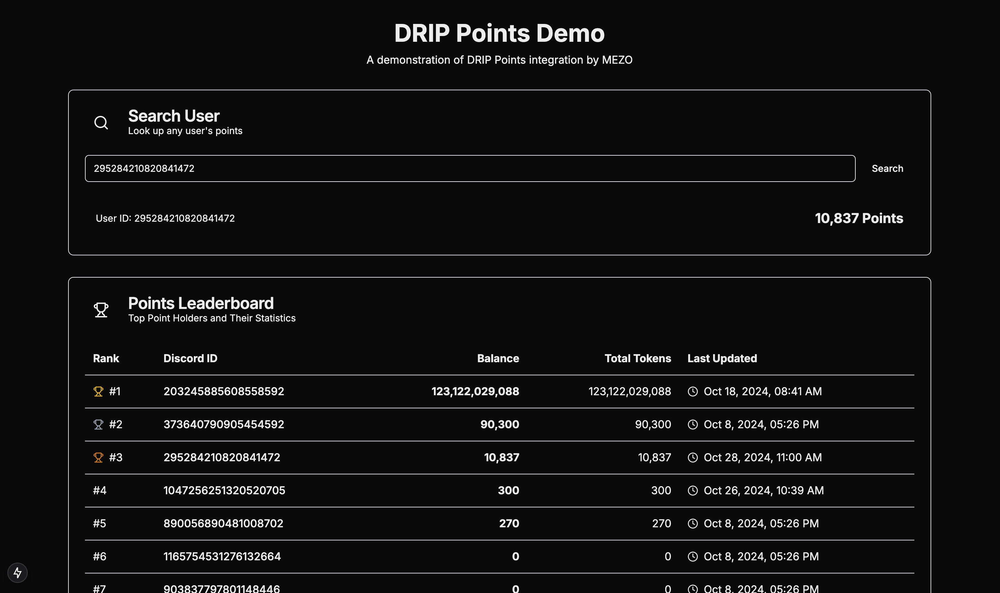

# MEZO x DRIP Points Demo

A Next.js application demonstrating the integration capabilities of DRIP's points system. This demo showcases real-time point tracking, leaderboards, and user searching functionality.



## Features

- 📊 **Real-time Leaderboard**
  - Track top point holders
  - View balances and total tokens
  - See user wallet addresses
  - Track last update timestamps

- 🔍 **User Search**
  - Look up any user by Discord ID
  - View detailed point balances
  - Instant search results

- 💫 **Modern UI/UX**
  - Clean, responsive design
  - Loading states
  - Error handling
  - Mobile-friendly interface

## Tech Stack

- [Next.js 14](https://nextjs.org/) - React Framework
- [Tailwind CSS](https://tailwindcss.com/) - Styling
- [Lucide Icons](https://lucide.dev/) - Icons
- [TypeScript](https://www.typescriptlang.org/) - Type Safety
- DRIP API Integration

## Getting Started

### Prerequisites

- Node.js 18+ 
- DRIP API Credentials
  - API Key
  - Realm ID

### Installation

1. Clone the repository:
```bash
git clone https://github.com/Cryptonite-Group-Inc/mezo-drip-hackaton-web-demo.git
cd mezo-drip-hackaton-web-demo
```

2. Install dependencies:
```bash
npm install
# or
yarn install
```

3. Create `.env.local` file:
```env
NEXT_PUBLIC_DRIP_API_URL=https://api.drip.re
DRIP_API_KEY=your_drip_api_key
DRIP_REALM_ID=your_realm_id
```

4. Run the development server:
```bash
npm run dev
# or
yarn dev
```

5. Open [http://localhost:3000](http://localhost:3000) with your browser to see the result.

## Project Structure

```
├── app/
│   ├── api/               # API routes
│   │   ├── leaderboard/   # Leaderboard endpoint
│   │   └── user/         # User search endpoint
│   ├── components/        # React components
│   │   ├── LeaderboardCard.tsx
│   │   └── SearchUser.tsx
│   ├── layout.tsx        # Root layout
│   └── page.tsx          # Home page
├── public/               # Static files
└── package.json         # Dependencies and scripts
```

## API Routes

### Leaderboard
- **GET** `/api/leaderboard`
  - Returns top point holders
  - Includes balances, tokens, and timestamps
  - Optional wallet addresses

### User Search
- **GET** `/api/user/[userId]`
  - Look up specific user's points
  - Returns detailed balance information

## Contributing

This is a demo project for hackathon purposes. Feel free to fork and expand upon it!

## Development Process

1. **Local Development**
   ```bash
   npm run dev
   ```

2. **Building for Production**
   ```bash
   npm run build
   ```

3. **Running Production Build**
   ```bash
   npm start
   ```

## Best Practices

- Keep API keys secure in `.env.local`
- Use TypeScript for type safety
- Follow the component structure
- Handle loading and error states
- Use proper semantic HTML

## Environment Variables

| Variable | Description | Required |
|----------|-------------|----------|
| `NEXT_PUBLIC_DRIP_API_URL` | DRIP API Base URL | Yes |
| `DRIP_API_KEY` | Your DRIP API Key | Yes |
| `DRIP_REALM_ID` | Your DRIP Realm ID | Yes |

## Common Issues

### API Key Invalid
- Ensure your DRIP API key is correctly set in `.env.local`
- Verify the key has proper permissions

### User Not Found
- Confirm the Discord ID is correct
- Check if the user exists in your DRIP realm

### Leaderboard Not Loading
- Verify your realm ID is correct
- Check your API rate limits

## Resources

- [Next.js Documentation](https://nextjs.org/docs)
- [Tailwind CSS Documentation](https://tailwindcss.com/docs)
- DRIP API Documentation (link to your API docs)
- [TypeScript Documentation](https://www.typescriptlang.org/docs)

## About

This demo was created by MEZO for the DRIP Hackathon to showcase the capabilities of DRIP's points system integration.
